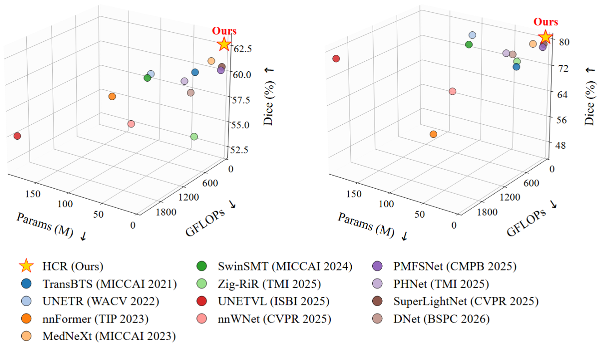
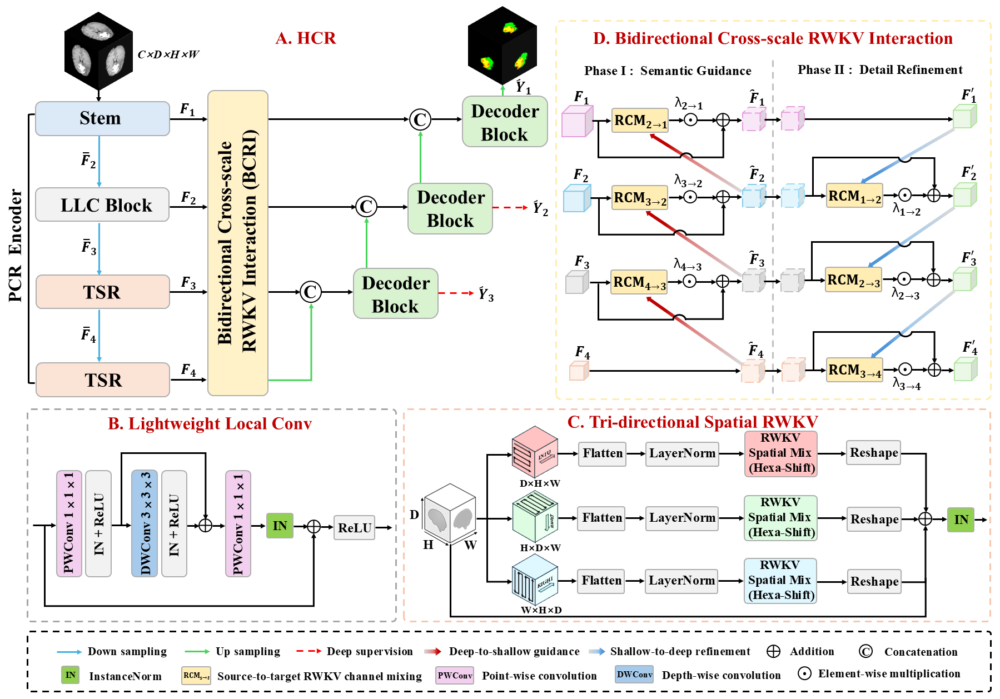
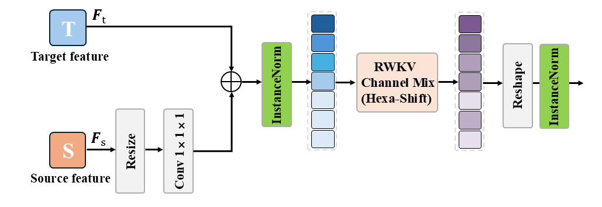
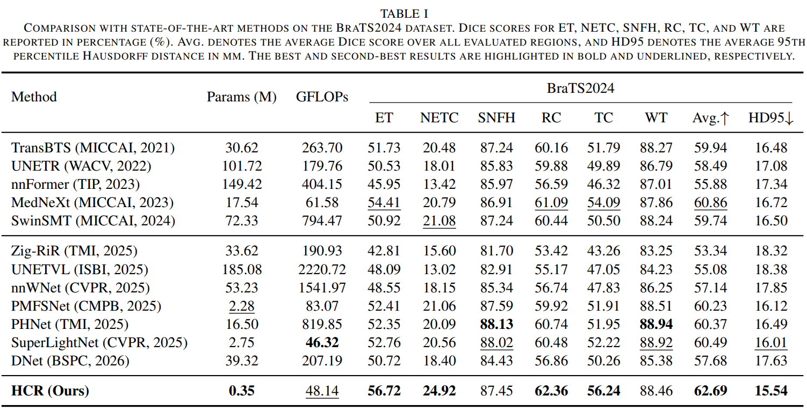
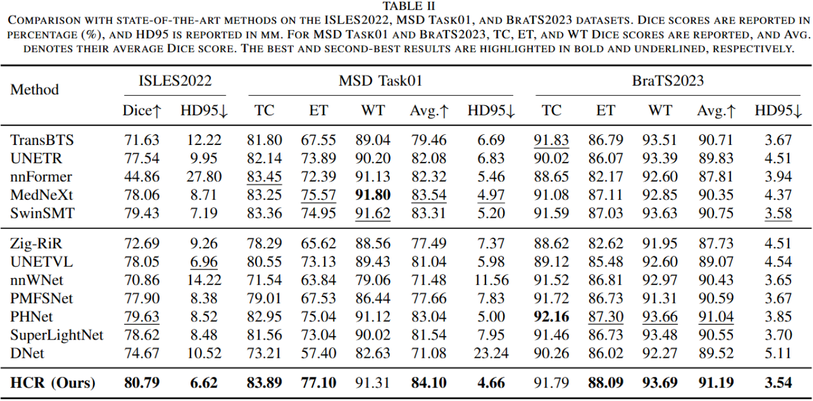
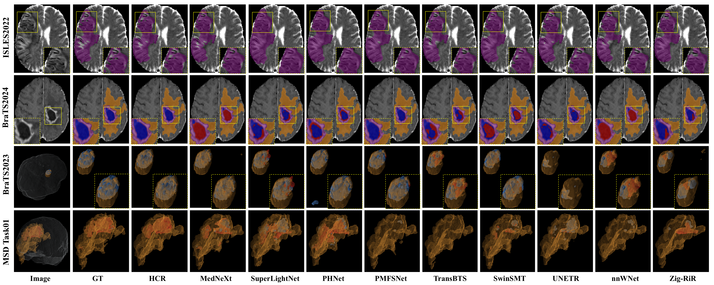
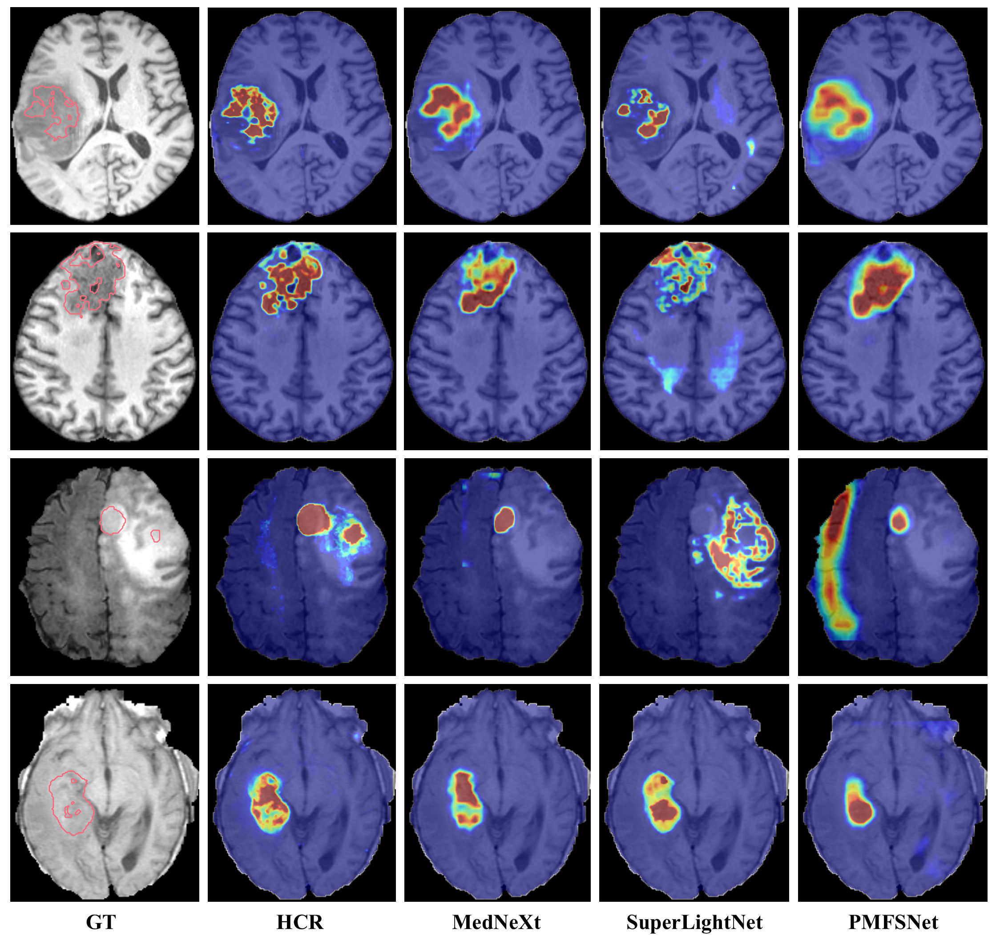

# Beyond Uniform Encoders: Hybrid Convolutional RWKV for 3D Brain Lesion Segmentation

> **Paper Title:** Beyond Uniform Encoders: Hybrid Convolutional RWKV for 3D Brain Lesion Segmentation
>
> **Conference:** BIBM 2026
>
> **Status:** 🟢 Under Review


---
## 📰 News

- **[2026-7-4]**  🔥 Paper submitted to BIBM 2026.

---

<p align="center">
  
</p>

<p align="center">
  <em>
  Performance-efficiency comparison on BraTS2024 and ISLES2022.
  HCR achieves a favorable balance between segmentation accuracy and computational efficiency.
  </em>
</p>

## 📌 Overview

Accurate 3D brain lesion segmentation requires preserving fine-grained structural details while capturing long-range volumetric dependencies. However, applying a uniform modeling strategy across all encoder stages overlooks the distinct representation characteristics of shallow and deep features. Meanwhile, conventional encoder-decoder fusion provides limited interaction between high-level semantic information and low-level spatial details.

To address these limitations, we propose **HCR**, a lightweight **Hybrid Convolutional RWKV** network for 3D brain lesion segmentation. The key idea is to move **beyond uniform encoders** by assigning different modeling operators to different encoding stages according to their feature characteristics.

HCR consists of two core designs:

- **Progressive CNN-RWKV (PCR) Encoder**, which employs Lightweight Local Conv (LLC) in shallow stages to preserve structural and boundary details, while introducing Tri-Directional Spatial RWKV (TSR) in deeper stages to capture long-range volumetric dependencies from multiple spatial orientations.
- **Bidirectional Cross-scale RWKV Interaction (BCRI)**, which uses the RWKV Channel Mixer (RCM) to perform deep-to-shallow semantic guidance and shallow-to-deep detail refinement across hierarchical features.

Extensive experiments on BraTS2023, BraTS2024, MSD Task01, and ISLES2022 demonstrate that HCR achieves the best overall segmentation performance across all four benchmarks while maintaining high computational efficiency. On BraTS2024, HCR achieves an average Dice score of 62.69% with only 0.35M parameters and 48.14 GFLOPs.

---

## ✨ Key Contributions

- **Beyond Uniform Encoder Design**  
  We introduce a progressive CNN-RWKV encoding strategy that assigns different modeling operators to different encoder stages. Lightweight convolution is used for shallow local representation, while RWKV-based sequence modeling is introduced in deeper stages for volumetric contextual modeling.

- **Tri-Directional Spatial RWKV**  
  We propose a TSR module that models 3D volumetric features along three spatial orders, i.e., DHW, HDW, and WHD. Combined with Hexa-Shift, TSR captures multi-orientation long-range dependencies while preserving local 3D neighborhood information.

- **Bidirectional Cross-Scale RWKV Interaction**  
  We develop a BCRI module for hierarchical feature collaboration. Through the RCM, BCRI performs deep-to-shallow semantic guidance followed by shallow-to-deep detail refinement.

- **Lightweight and Accurate 3D Segmentation**  
  HCR achieves consistent performance across four 3D brain lesion segmentation benchmarks while maintaining only 0.35M parameters and 48.14 GFLOPs, demonstrating a favorable accuracy-efficiency trade-off.

---


## 🏗️ Framework Architecture

The overall framework follows a U-shaped encoder-decoder structure.

<p align="center">
  
</p>

<p align="center">
  <em>Overall architecture of HCR.</em>
</p>


## 🧩 RWKV Channel Mixer

RCM serves as the source-to-target interaction unit in BCRI. It aligns the source feature to the target representation and applies RWKV Channel Mix with Hexa-Shift to generate cross-scale enhancement features.

<p align="center">
  
</p>

<p align="center">
  <em>Detailed design of the RCM module.</em>
</p>


## 📊 Results & Visualization

### 1. Quantitative Comparison

<p align="center">
  
</p>


<p align="center">
  
</p>


### 2. Qualitative Visualization

<p align="center">
  
</p>

<p align="center">
  <em>Visualization examples of segmentation results by different methods on
ISLES2022, BraTS2024, BraTS2023, and MSD Task01 datasets.</em>
</p>


### 3. Feature Activation Visualization

<p align="center">
  
</p>

<p align="center">
  <em>Feature activation visualization of HCR and competing methods. HCR produces more compact and lesion-focused activation responses that better align with the ground-truth lesion regions.</em>
</p>


## 📦 Data downloading

### ISLES 2022
 
Data is from [https://www.kaggle.com/datasets/dearsayan/isles20222](https://www.kaggle.com/datasets/dearsayan/isles20222)

The data structure will be in this format:

```text
data/
└── derivatives/
    ├── sub-strokecase0001/
    │   ├── ses-0001
    │         ├── ant
    │             ├── sub-strokecase0001_ses-0001_FLAIR.nii.gz
    │         ├── dwi
    │             ├── sub-strokecase0001_ses-0001_adc.nii.gz
    │             ├── sub-strokecase0001_ses-0001_dwi.nii.gz
    ├── sub-strokecase0002/
    │   └── ...
    ├── sub-strokecase0003/
    │   └── ...
    ├── dataset_description.json
    └── README
```


### BraTS 2023 and BraTS 2024

Data of BraTS 2023 is from [https://www.synapse.org/Synapse:syn51156910/wiki/621282](https://www.synapse.org/Synapse:syn51156910/wiki/621282)

Data of BraTS 2024 is from [https://www.synapse.org/Synapse:syn53708249/wiki/626323](https://www.synapse.org/Synapse:syn53708249/wiki/626323)

The BraTS 2023/2024 structure will be in this format:

<table style="width: 100%; table-layout: fixed;">
  <thead>
    <tr>
      <th align="center">BraTS 2023</th>
      <th align="center">BraTS 2024</th>
    </tr>
  </thead>
  <tbody>
    <tr>
      <td valign="top">
<pre>
data/
└── ASNR-MICCAI-BraTS2023-GLI-Challenge-TrainingData/
    ├── BraTS-GLI-00000-000/
    │   ├── BraTS-GLI-00000-000-seg.nii.gz
    │   ├── BraTS-GLI-00000-000-t1c.nii.gz
    │   ├── BraTS-GLI-00000-000-t1n.nii.gz
    │   ├── BraTS-GLI-00000-000-t2f.nii.gz
    │   └── BraTS-GLI-00000-000-t2w.nii.gz
    ├── BraTS-GLI-00002-000/
    │   └── ...
    ├── BraTS-GLI-00003-000/
    │   └── ...
    └── ...
</pre>
      </td>
      <td valign="top">
<pre>
data/
└── BraTS2024-BraTS-GLI-TrainingData/
    ├── BraTS-GLI-00005-100/
    │   ├── BraTS-GLI-00005-100-seg.nii.gz
    │   ├── BraTS-GLI-00005-100-t1c.nii.gz
    │   ├── BraTS-GLI-00005-100-t1n.nii.gz
    │   ├── BraTS-GLI-00005-100-t2f.nii.gz
    │   └── BraTS-GLI-00005-100-t2w.nii.gz
    ├── BraTS-GLI-00005-101/
    │   └── ...
    ├── BraTS-GLI-00006-100/
    │   └── ...
    └── ...
</pre>
      </td>
    </tr>
  </tbody>
</table>

### MSD Task01

Data is from http://medicaldecathlon.com/

The data structure will be in this format:
```text
data/
└── Task01_BrainTumour/
    ├── BRATS_001/
    │   ├── img.nii.gz
    │   └── seg.nii.gz
    ├── BRATS_002/
    │   ├── img.nii.gz
    │   └── seg.nii.gz
    ├── BRATS_003/
    │   ├── img.nii.gz
    │   └── seg.nii.gz
    ├── BRATS_004/
    │   └── ...
    ├── BRATS_005/
    │   └── ...
    └── ...
```

## ⚡ Environment install
### Configuring your environment

Creating a virtual environment in terminal: conda create -n HCR python=3.12

Enter the environment: conda activate HCR

Install the necessary packages: 
```bash
pip install torch==2.5.1 torchvision==0.20.1 torchaudio==2.5.1 --index-url https://download.pytorch.org/whl/cu124
pip install -r requirements.txt
```
## 🚀  Preprocessing, training, and testing

 ### Brain Lesion - ISLES 2022, BraTS 2023 , BraTS 2024 and MSD Task01
🆓 Preprocessing

The data directory of ISLES 2022 is : "./data/ISLES-2022/";

The data directory of BraTS 2023 is : "./data/ASNR-MICCAI-BraTS2023-GLI-Challenge-TrainingData/";

The data directory of BraTS 2024 is : "./data/BraTS2024-BraTS-GLI-TrainingData/";

The data directory of MSD Task01 is : "./data/Task01_BrainTumour/";

First, we need to run the renaming process and format reorganization. For ISLES 2022, the raw data will be reorganized into a standardized format in "./data/ISLES_Handle".

```bash 
python 1_reorganize_ISLES2022.py    or    python 1_rename_BraTS2023.py    or    python 1_rename_BraTS2024.py    
```

Then, we need to run the pre-processing code to do resample, normalization, and crop processes.

```bash
python 2_preprocessing_ISLES2022.py    or    python 2_preprocessing_BraTS2023.py    or    python 2_preprocessing_BraTS2024.py    or    python 2_preprocessing_MSD_Task01.py
```

#### 🆓 Training 

When the pre-processing process is done, we can train our model.

**Dataset Splits**
| Dataset / Task                 | Test list path / Notes                                                                 |
|--------------------------------|---------------------------------------------------------------------------------------|
| ISLES 2022                      | `./ISLES2022/data/test_list.py` 
| BraTS 2023                      | `./BraTS2023/data/test_list.py`              
| BraTS 2024                      | `./BraTS2023/data/test_list.py`  |
| MSD Task01                      | `./MSD_Task01/data/test_list.py`


We mainly use the pre-processde data from last step: **data_dir = ./data/train_fullres_process**


```bash 
python 3_train.py
```

#### 🆓 Testing

When we have trained our models, we can inference all the data in testing set.

We mainly use the pre-processde data from "Preprocessing" step: **data_dir = ./data/train_fullres_process**; 

The original data (**"./data/ISLES_Handle/" || ./data/ASNR-MICCAI-BraTS2023-GLI-Challenge-TrainingData/" || "./data/BraTS2024-BraTS-GLI-TrainingData/" || "./data/Task01_BrainTumour/"**);

And the parameter you get from last step: **model_path = ./data/3D_parameter_ISLES2022/HCR_ISLES2022.pth || ./data/3D_parameter_BraTS2023/HCR_BraTS_2023.pth  || ./data/3D_parameter_BraTS2024/HCR_BraTS_2024.pth || ./data/3D_parameter_MSD_Task01/HCR_MSD_Task01.pth**.

```bash 
python 4_predict_assemble.py
```
